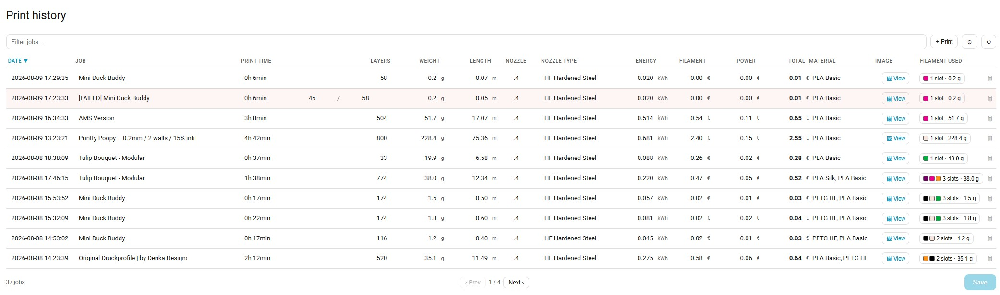

# Bambu Print Costs


A Home Assistant integration that works out what a 3D print actually cost — filament per
AMS slot, electricity, and a per-job history — and ships the Lovelace cards to manage it.

Point it at your printer during setup and the sensors are found for you. The filament
slots are free-form, so any AMS layout — or none — works.



## Highlights

- **Per-slot filament costing** from your own tag library, priced by the RFID tag of the
  spool actually loaded — a spool's two tags count as one spool. Cloned tags work like
  originals; generic untagged spools work too, priced by hand per slot or falling back
  to the default ([details](docs/filament.md)).
- **Electricity integrated, not estimated**: a variable tariff is charged as it moved
  during the print, standby between prints is counted, and even an aborted print's
  power reaches the total. Cross-checked against the energy counters, so a smart plug
  dropping off the network cannot silently under-bill a job.
- **A job log with pictures** — the slicer's render, or a camera photo of what actually
  came off the plate.
- **Spools scan themselves in**: loading an unknown tag appends a library row, named
  from Bambu's colour palette, ready for you to price.
- **Three cards** — tag library editor, print history, quote calculator — registered
  automatically, no resource wrangling.
- **No automations required** — logging, meter snapshots, slot prices, durations and
  idle tracking are the integration's own job. The ones worth adding are notifications,
  and the [Automations](#automations) section has them ready to paste.
- Survives restarts, reconnects and mid-print dropouts without losing or double-counting
  a cent. One example: a Home Assistant restart mid-print loses the printer
  integration's per-slot weight attributes — this integration keeps its own snapshot of
  the split and restores it after the restart, so the job is still priced per slot
  instead of falling back to the default
  ([details](docs/filament.md#surviving-a-restart-mid-print)).

## Install

**HACS** → three-dot menu → _Custom repositories_ → add
`https://github.com/Oose97/ha-bambu-costs` as an **Integration**, then download it and
restart Home Assistant.

**Manually**: copy `custom_components/bambu_costs` into your `config/custom_components/`
and restart.

Then _Settings → Devices & Services → Add Integration → Bambu Print Costs_. Pick your
printer and the sensors are filled in for you — see [Setup](docs/setup.md).

Requires Home Assistant 2024.12+ and a printer integration whose sensors this reads —
in practice [ha-bambulab](https://github.com/greghesp/ha-bambulab). Every sensor is
picked during setup rather than wired to ha-bambulab's internals, so a fork or another
printer integration works too, as long as it exposes per-slot print weights.

## Documentation

### Setup

Go to [Setup](docs/setup.md) for more details.

- Pick the printer device and everything fills itself in — sensors matched by
  `translation_key`, slots read off the print weight sensor, or derived from the AMS
  devices when the printer is idle.
- Slots are free-form lines: `Attribute|Label|tray_sensor`. Re-scans are additive —
  configured slots are never dropped or relabelled.
- With an electricity price **sensor** set, it is what every calculation follows, live;
  the fixed price is only its fallback. Currency is free text and flows everywhere.

### Entities & services

Go to [Entities & services](docs/entities.md) for more details.

- Sensors for the live breakdown, session filament and power cost, cost rate, lifetime
  totals (including a `utility_meter`-ready one), the tag library with its spool
  counts, and the job log.
- Writable numbers for every price, marker and total; a charge button for partial
  prints; a switch choosing camera photos over the slicer's render for job covers.
- Services to log a job with overrides, edit or delete log rows, log a failed print
  with explicit figures, write the tag library, set a tag's price, sync slot prices,
  and import legacy CSVs. **No automations required** — finished jobs log themselves.

### Electricity costing

Go to [Electricity costing](docs/costing.md) for more details.

- Power × live price, integrated over time — a variable tariff is charged as it moved,
  standby between prints counts, and an aborted print's electricity still reaches the
  total.
- Cross-checked against the energy counters, so a plug dropping off the network cannot
  silently under-bill a job; implausible counter jumps are rejected as discontinuities.
- Monthly figures are one `utility_meter` away, pointed at the total-spend sensor —
  that and more ready-made recipes under
  [Suggested helpers](docs/costing.md#suggested-helpers).

### Filament pricing

Go to [Filament pricing](docs/filament.md) for more details.

- Loading an unknown tagged spool adds a library row by itself; rows can also be added
  by hand — any way of reading the tag UID works, the AMS just makes it automatic.
- A slot's price: the loaded spool's tag first, the slot's own number second, the
  default last. A generic untagged spool's hand-set price is never overwritten.
- Colours are named per material **and product line** (`#FFFFFF` is Jade White as PLA
  Basic, Ivory White as PLA Matte); unknown hexes get one optional web lookup. The
  per-slot split survives restarts mid-print.

### Cards

Go to [Cards](docs/cards.md) for more details.

- **Tags editor** — spool pairs as one row, a palette-wide filtering combo for colour
  names, drag or button reordering, per-browser table settings.
- **Print history** — fully editable in place, per-slot breakdown modal, nozzle combos,
  row deletion, a pre-filled failed-print form that scales the plan by the layers that
  finished, content-sized columns, pinned header, configurable columns/sort/page
  size/height.
- **Cost calculator** — quotes from your real spool prices plus runtime, margin and
  VAT. All three register themselves as Lovelace resources.

### Data on disk

Go to [Data on disk](docs/data.md) for more details.

- Two CSVs and the cover images per entry, under `config/bambu_costs/`; hand-editable,
  headerless files tolerated, `.bak` written before any whole-file save.
- Bulky attributes are excluded from the recorder automatically.

### Releasing

Go to [Releasing](docs/releasing.md) for more details.

- The version lives in `manifest.json`; a release is cut automatically once Validate
  passes on `main`.

## Automations

None are required — logging, snapshots, slot prices and idle tracking are the
integration's own job. But everything it writes is a clean trigger. The job log and tag
library sensors hold their **row count** as state, so "the count went up" is the
signal that a job was logged or a spool was scanned — better than triggering on the
printer's finish transition, because the row is already written when it fires, aborted
prints never trigger it, and the once-per-job guard comes free.

**Notify when a job is logged**, with its real figures:

```yaml
alias: "Printer: notify on logged job"
triggers:
  - trigger: state
    entity_id: sensor.bambu_costs_job_log
    not_from: ["unknown", "unavailable"]
    not_to: ["unknown", "unavailable"]
conditions:
  - condition: template
    value_template: "{{ (trigger.to_state.state | int(0)) > (trigger.from_state.state | int(0)) }}"
actions:
  - variables:
      row: "{{ state_attr('sensor.bambu_costs_job_log', 'data') | last }}"
  - action: notify.notify
    data:
      title: Print finished
      message: >-
        {{ row.job }} — {{ row.weight }} g of {{ row.types }} for
        {{ (row.cost | float(0)) | round(2) }}
        ({{ (row.f_cost | float(0)) | round(2) }} filament,
        {{ (row.p_cost | float(0)) | round(2) }} power)
mode: single
```

**Remind to price a newly scanned spool** — scanned rows start at price 0:

```yaml
alias: "Printer: new spool scanned"
triggers:
  - trigger: state
    entity_id: sensor.bambu_costs_tag_library
    not_from: ["unknown", "unavailable"]
    not_to: ["unknown", "unavailable"]
conditions:
  - condition: template
    value_template: "{{ (trigger.to_state.state | int(0)) > (trigger.from_state.state | int(0)) }}"
actions:
  - variables:
      tag: "{{ state_attr('sensor.bambu_costs_tag_library', 'data') | last }}"
  - action: notify.notify
    data:
      title: New spool scanned
      message: "{{ tag.filament }} · {{ tag.color_name }} — set its price in the tags card"
mode: single
```

Other worthwhile triggers: `numeric_state` on the **cost rate** or **last idle cost**
(the printer left running expensively), a threshold on a `utility_meter` fed by the
**total spend** sensor (monthly budget), or calling **`bambu_costs.log_job`** with
`force: true` from a script to re-log a job with corrected values.

## Not part of the integration

- **A dashboard.** The three cards are provided — where they go is yours to decide.
- **Automatic pricing for untagged spools.** RFID tags are the primary data source: a
  tagged spool prices its slot by itself, and that is the workflow this integration is
  built around. Untagged spools still work, per AMS slot — set the slot's price number
  by hand and it is respected, never overwritten — but that manual path is a
  nice-to-have fallback, and guessing a price from material or colour is not planned.
  Without a manual price, the slot is costed at the default. If you want the automated
  process and a managed filament library without printing Bambu Lab filament, check out
  the [Bambu Lab RFID Tag Guide](https://github.com/queengooborg/Bambu-Lab-RFID-Tag-Guide).

## License

MIT — see [LICENSE](LICENSE).

The bundled brand sources keep their own terms: the euro glyph is public domain
(Openclipart), and the Bambu Lab mark is Bambu Lab's trademark, used to identify the
hardware this integration is for.
