# Cards

Registered automatically as Lovelace module resources, with the integration's version
and each file's own timestamp appended — so an upgrade, or even a hand-copied newer
file, busts the browser cache on its own. They show up under
Settings → Dashboards → Resources, and are removed when the last config entry is
deleted. In YAML-mode Lovelace the files are still served — the URLs are logged at
startup for you to add by hand.

## Tags editor

`custom:bambu-costs-tags-editor` — editable, reorderable filament tag library.

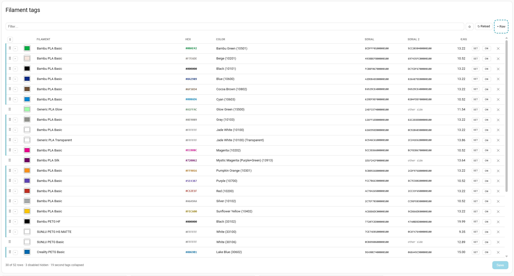

- A spool's two tags render as one row, the second tag a child row behind a **▸** on the
  spool's handle — collapsed by default, with the default changeable in settings.

  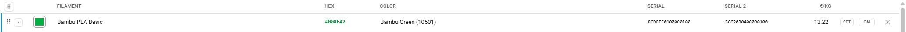
  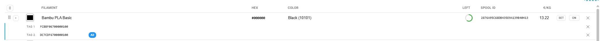
- Editing a pair's filament, colour or price applies to both rows; serials stay per-row,
  since they are what tell the two tags apart. Typing a spool's second serial pairs the
  rows on the spot.
- The colour-name cell is a combo over the whole Bambu palette: click it and the full
  list drops down, scrollable; start typing and it filters. The list is a convenience,
  not a constraint — anything you type is accepted as-is.

  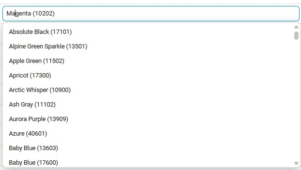
- Pairs share one handle and move as a unit, and reordering works with rows hidden — it
  steps over what is not shown. Filtering finds collapsed second tags and surfaces them
  with their spool.
- **⚙** opens the table settings: show-disabled, expand-by-default, sorting, the table
  height, and the column layout (display only — a save always writes every field in
  canonical order).

  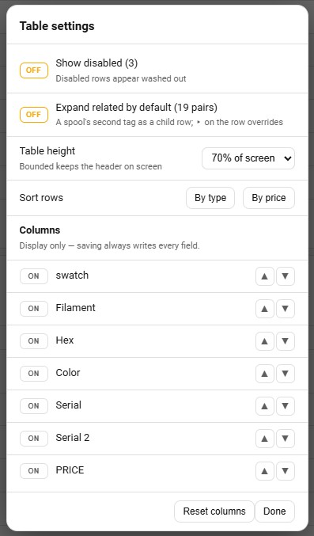
- By default the table is bounded to 70% of the screen and scrolls inside its own box,
  which keeps the header row pinned while a long library scrolls under it. "Unlimited"
  in the settings grows the card with the page instead.
- The footer counts rows and **spools** — a pair is one spool — with the active count
  beside it, tracking unsaved edits live. The saved figures are also published as the
  `spools` and `active_spools` [sensors](entities.md#sensors), ready for a badge or an
  automation.
- Each row's **SET** button opens a picker listing every filament price entity — the
  default first, then one per configured slot — so a tag's price can be pushed into
  whichever slot has that spool loaded. The list is resolved from the entity registry,
  so it follows the slot configuration on its own.

  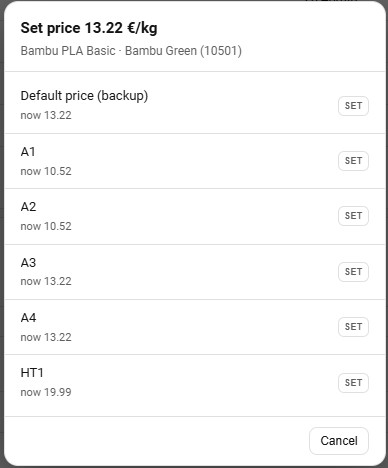

- Works on a phone and follows the theme — on touch, reordering switches to ↑/↓
  buttons on its own:

  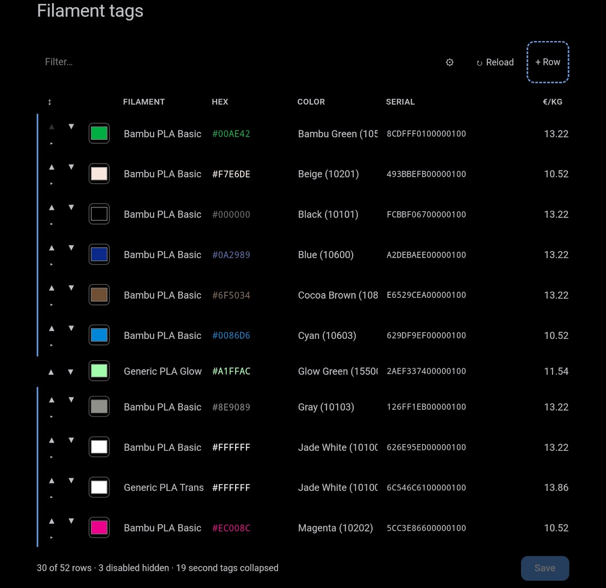

```yaml
type: custom:bambu-costs-tags-editor
entity: sensor.bambu_costs_tag_library
```

## Jobs table

`custom:bambu-costs-jobs-table` — editable print history: sortable, paginated, with
configurable columns. Pictured at the top of the [README](../README.md); the filter
narrows it to anything — a date, a job name, a material:

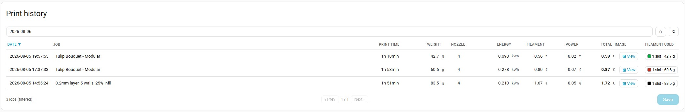

- Every value field edits in place — click a cell, type, and press **Save**. Nozzle
  size and type are combo fields: free text, with the printer's own vocabulary offered
  as a dropdown (labels prettified, the printer's spelling stored). **Discard** appears
  beside Save while there are unsaved edits.

  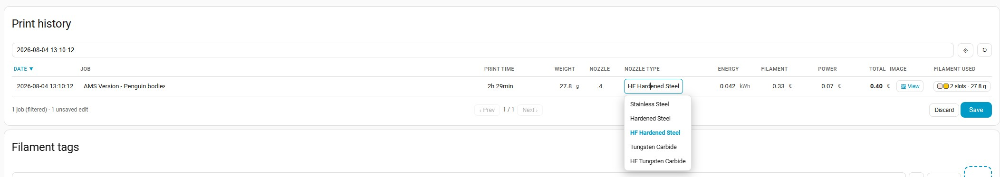 Only the
  rows you touched are written, matched into the file by the timestamp they were loaded
  with, so jobs logged while you were editing are never overwritten. The previous file
  is kept as `jobs.csv.bak`.
- Every row carries a **🗑** button. A deletion is staged like any other edit — the row
  is struck through, the button flips to ↩ to take it back, and only **Save** actually
  removes it from the file (with the previous version in `jobs.csv.bak` as the net).
- **+ Print** in the toolbar expands to the two manual forms: *Add failed print* and
  *Add finished print*. The failed one logs a print that died part-way. The form is
  pre-filled by the integration — from the print running now, or the last one once the
  printer is idle — with one extra field: **how many layers finished**. The filament
  figures start as the job's plan scaled by that ratio (the printer only ever reports
  planned weights), and editing the layer count rescales them; duration, energy and
  electricity are the stint's measured reality and are not scaled — for a print still
  running, the Print time field notes the planned duration alongside, the way the
  layers pair reads done against total. Everything is
  editable, per AMS slot included. The picture is a deliberate choice: press
  **📷 Capture photo** for a camera shot of the failed plate, or Save stores the
  slicer's render. A checkbox (on by default) banks the row's filament — the scaled
  figures, not the full plan — to the lifetime totals on save.
- ***Add finished print*** is its twin, for a completed job the integration never saw
  finish — Home Assistant down at the moment the printer reported it, or a job worth
  logging after the fact. Same pre-filled form, minus the layer scaling: the plan
  stands as reported, a single Layers field, and the same capture button and totals
  checkbox.
- A failed print's row wears the faintest red wash, and its **Layers** cell shows
  `finished/total` — both halves editable. **Hide failed prints** in the settings is on
  by default; the footer counts what is hidden.
- **⚙** opens the table settings: column order and visibility, the default sort column
  and direction, the rows per page, and the table height — all remembered per browser.
  Display only; a save always writes every field.

  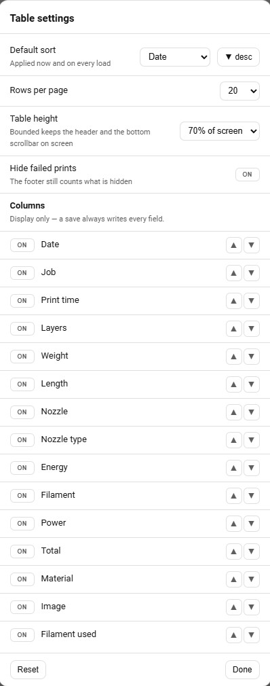
- By default the table is bounded to 70% of the screen and scrolls inside its own box:
  the header row stays pinned while long pages scroll under it, and the horizontal
  scrollbar sits at the bottom of the box instead of below the last row. "Unlimited"
  grows the card with the page instead.
- The **Material** column lists each distinct filament type once. For display it is
  shortened to just the type whatever the brand — a stored `SUNLU PETG` reads `PETG`,
  `Bambu PLA Matte` reads `PLA Matte` — matched against a list of known type names
  (the Bambu lineup by default, editable in the integration's options); the tooltip
  keeps the full stored value, which never changes.
- The image cell is a **View** button opening the job's cover in a modal — with the
  camera switch on, that's a photo of what actually came off the plate:

  

- **Filament used** is a compact per-row summary; clicking it opens the per-slot
  breakdown, where every field — label, material, colour, name, weight, price, cost —
  edits in place, cost following weight and price the way the logger computed it.

  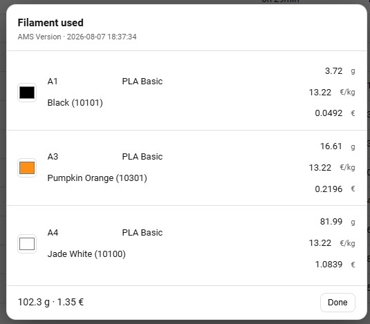

  A multi-material job carries the full product name per slot, while the Material
  column above shows the shortened pair (`PLA Basic, PETG HF`):

  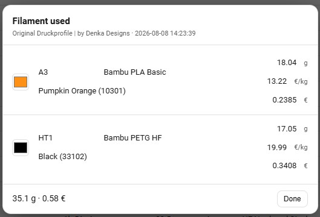

```yaml
type: custom:bambu-costs-jobs-table
entity: sensor.bambu_costs_job_log
page_size: 20
```

`page_size` is the default page length for browsers that have not chosen their own in
the settings.

## Cost calculator

`custom:bambu-costs-calculator` — manual quote: filament, runtime, margin, VAT. Paired
tags collapse to one dropdown entry, and an **Other** option takes a hand-typed price.

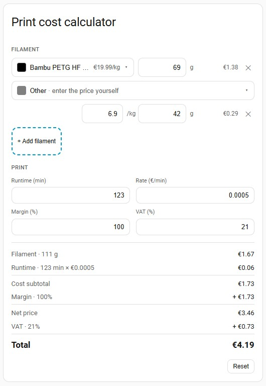

```yaml
type: custom:bambu-costs-calculator
entity: sensor.bambu_costs_tag_library
rate_per_minute: 0.0008
margin_percent: 30
vat_percent: 21
```
