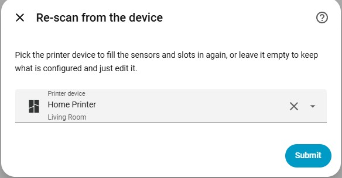
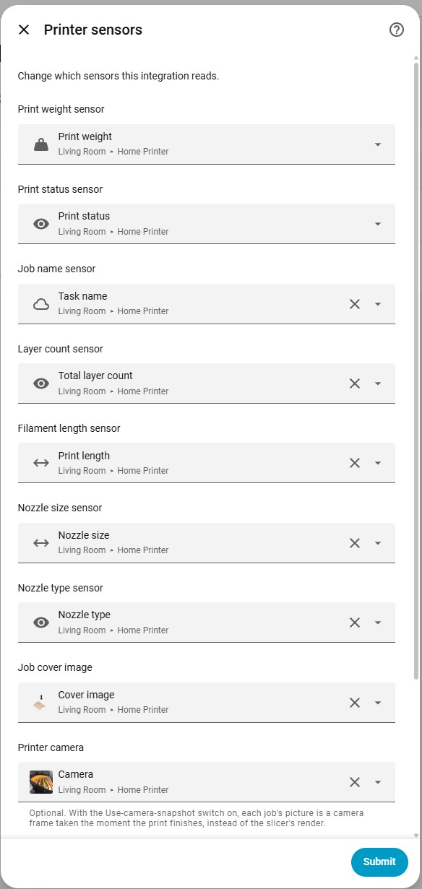
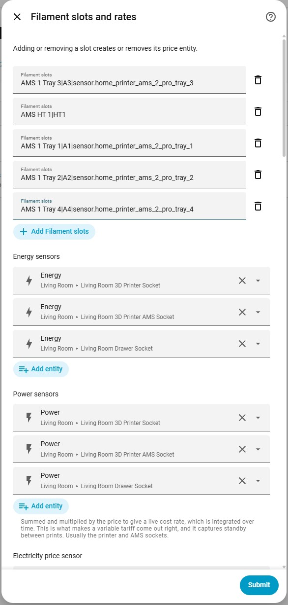
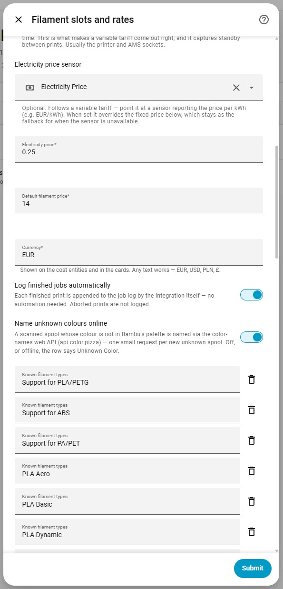

# Setup

## Requirements

Home Assistant 2024.12 or newer, and a source of printer sensors — in practice the
[ha-bambulab](https://github.com/greghesp/ha-bambulab) integration, which is what this was
built against and what the setup screen expects to find.

That dependency is declared as `after_dependencies`, not `dependencies`: if `bambu_lab` is
installed it loads first so its sensors exist before the first refresh, but this
integration will still set up without it. All data comes in through the entities you pick
during setup rather than through ha-bambulab's internals, so a fork — or an entirely
different printer integration — works too, as long as it exposes a per-slot print weight
sensor.

## The setup flow

**Step 1 — pick the printer device.** The list is narrowed to the printer's brand, and
picking an accessory works too: AMS units hang off the printer via `via_device`, and
discovery walks that chain to its root. Everything else is filled in from the device: the
sensors, and any AMS slots the printer is currently reporting, each paired with its tray.
Leave it empty to configure by hand.



Entities are matched on their `translation_key`, not on entity-id suffixes, so a renamed
entity is still found — `subtask_name` is displayed as "Task name", which is where
`sensor.…_task_name` comes from, and matching on the key survives that. Slot attribute
names are read off the print weight sensor rather than invented, and a tray is attached
only when the pairing is unambiguous; anything doubtful is listed for you instead.

The catch: the printer only reports per-slot attributes for slots the *current* job
uses. Attribute names visible right now are always matched verbatim; when none are
visible at all — an idle printer, or one straight after a restart — the slot lines are
instead **derived from the AMS devices' own names**, which carry the same numbering the
attributes are built from. Derived lines are a pre-fill like everything else here:
shown on the form for review, and at runtime a slot only ever matches the sensor's
attributes verbatim. Re-running discovery from the options later refines things —
additively: slots you already have are never dropped or relabelled by a re-scan, a
discovered tray fills in an entry that lacked one, and new attributes are appended.
Removing a slot is always a deliberate edit of the list.

**Step 2 — sensors.** Whatever was found, shown so you can correct it before continuing.
This is also where the optional **printer camera** goes — see
[Job pictures](entities.md#job-pictures).



**Step 3 — slots and rates.** Add one entry per filament source, using the attribute name
exactly as the print weight sensor reports it:

```
AMS 1 Tray 1
AMS 1 Tray 2|A2
AMS HT 1|HT|sensor.printer_ams_ht_tray_1
```

- **First part** — the `print_weight` attribute name. Matched verbatim, never guessed:
  these names have changed across printer-integration releases before, and a guess that
  silently misses is worse than a blank.
- **Second part** *(optional)* — a short label for the dashboard.
- **Third part** *(optional)* — the tray sensor. Supplies the colour and material for the
  job log, and its `tag_uid` prices the slot straight from your tag library.

Leave the list empty if you do not use an AMS; everything is then priced at the default.



The same step carries the rates and the display options — the electricity price sensor
and its fixed fallback, the default filament price, currency, auto-logging, the online
colour-name lookup, and the [known filament types](cards.md#jobs-table) list the jobs
card shortens material names against:



## Electricity price

Two fields on the slots-and-rates step work as a pair:

- **Electricity price sensor** *(optional)* — point it at a sensor reporting your price
  per kWh (a Nordpool spot price, a dynamic tariff, a template of your contract). When
  set, **this is what every calculation uses**, read live — so a tariff that moves
  mid-print is charged as it actually moved.
- **Electricity price** — a fixed number per kWh. With a sensor configured it is *only
  the fallback*, used for the stretches where the sensor is unavailable or reports
  something that is not a number; the moment the sensor recovers, it takes over again.
  Without a sensor, this number simply is the price.

The fixed price is also exposed as a `number` entity, so the fallback can be adjusted
any time without reopening the options. How the price feeds the cost integral is
covered in [Electricity costing](costing.md).

## Currency

Set during setup, prefilled with `EUR`, and changeable in the options. It is display-only —
any text works — and flows through the number entities' units, both cost sensors, and the
cards, which pick it up from the integration rather than needing their own setting.

## Icon

Shipped with the integration in `custom_components/bambu_costs/brand/` — the official
mechanism since Home Assistant 2026.3: local brand images are served through the
brands proxy API and take priority over the CDN, and the central brands repository no
longer accepts new custom integrations at all. On older Home Assistant versions the
default placeholder shows instead.

One consequence applies to every custom integration published after that cut-off: the
HACS **store listing** fetches icons from the CDN, and an integration that is not yet
installed has no local files to serve — so the store shows a placeholder until the
integration is installed. Integrations that entered the brands repository before the
change are grandfathered and keep their store icons.
